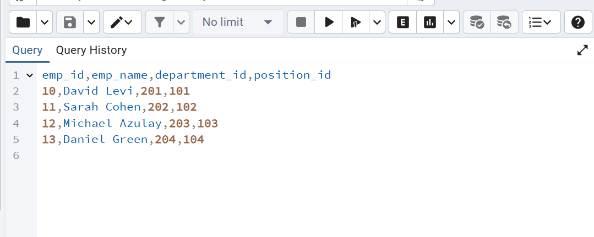

# שלב א – עיצוב בסיס נתונים ואכלוס נתונים

## שער
**שמות מגישים:** אביתר סאסי, ישראל שעשוע  
**המערכת:** מערכת ניהול עובדים  
**היחידה הנבחרת:** אגף משאבי אנוש

---

## תוכן עניינים
1. [מבוא](#מבוא)
2. [תרשימי ERD ו־DSD](#תרשימי-erd-ו־dsd)
3. [החלטות עיצוב](#החלטות-עיצוב)
4. [שיטות הכנסת נתונים](#שיטות-הכנסת-נתונים)
5. [גיבוי ושחזור](#גיבוי-ושחזור)

---

## מבוא
המערכת שפותחה עוסקת בניהול עובדים בחברה. היא שומרת מידע על עובדים, מחלקות, תפקידים, חוזים, נוכחות ובקשות חופשה.  
המטרה העיקרית של המערכת היא לאפשר שמירה, חיפוש וניתוח של נתונים תפעוליים הקשורים לניהול כח אדם, כולל מעקב אחרי זמני כניסה/יציאה, ניהול חופשות ומבנה ארגוני.

---

## תרשימי ERD ו־DSD

### תרשים ERD:

### תרשים DSD (סכמה יחסית מתוך pgAdmin):

---

## החלטות עיצוב

- בחרנו ב־6 ישויות עיקריות: `Employee`, `Position`, `EntityDepartment`, `Contract`, `Attendance_Log`, `Leave_Requests`.
- כל ישות כוללת לפחות 3 שדות, ומתוכם לפחות שניים מסוג `DATE`.
- עיצבנו את הסכמה כך שכל הקשרים בין הישויות יהיו חד־ערכיים ומבוססי `Primary Key` ו־`Foreign Key`.
- הסכמה מנורמלת ל־3NF:
  - חוזים מופרדים מטבלת עובדים.
  - תפקידים ומחלקות מוגדרים כטבלאות נפרדות עם זיהוי ברור.
- נעשה שימוש ב־`varchar`, `int`, `date`, `numeric` ו־`time`.

---

## שיטות הכנסת נתונים

בחרנו בשלוש שיטות שונות:

### 1. הכנסת נתונים ידנית דרך pgAdmin

### 2. ייבוא מקובץ CSV

### 3. שימוש בסקריפט Python להפקת פקודות INSERT

---

## גיבוי ושחזור

### ביצוע גיבוי
בוצע גיבוי מלא של בסיס הנתונים:

### שחזור הנתונים על מחשב אחר
בוצע ניסיון שחזור לקובץ הגיבוי דרך pgAdmin:

---

## סיום
המערכת נבדקה על־ידי גיבוי, שחזור והרצת שאילתות.  
השלב הבא הוא כתיבת שאילתות מתקדמות (שלב 2).

