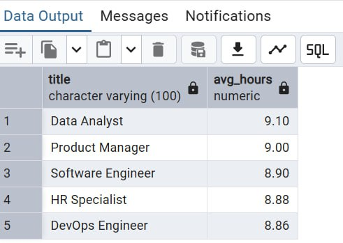

# שלב א – עיצוב בסיס נתונים ואכלוס נתונים

## שער

**שמות מגישים:** אביתר סאסי, ישראל שעשוע
**המערכת:** מערכת ניהול עובדים
**היחידה הנבחרת:** אגף משאבי אנוש

---

## תוכן עניינים

1. [מבוא](#מבוא)
2. [תרשימי ERD ו‏‐ DSD](#תרשימי-erd-ו‏‐-dsd)
3. [החלטות עיצוב](#החלטות-עיצוב)
4. [שיטות הכנסת נתונים](#שיטות-הכנסת-נתונים)
5. [גיבוי ושחזור](#גיבוי-ושחזור)
6. [שלב ב – שאילתות ואילוצים](#שלב-ב--שאילתות-ואילוצים)
7. [אילוצים וטריגרים](#אילוצים-וטריגרים)

---

## מבוא

המערכת שפותחה עוסקת בניהול עובדים בחברה. היא שומרת מידע על עובדים, מחלקות, תפקידים, חוזים, נוכחות ובקשות חופשה.
המטרה העיקרית של המערכת היא לאפשר שמירה, חיפוש וניתוח של נתונים תפעוליים הקשורים לניהול כח אדם, כולל מעקב אחרי זמני כניסה/יציאה, ניהול חופשות ומבנה ארגוני.

---

## תרשימי ERD ו‏‐ DSD

### תרשים ERD:

### תרשים DSD (סכמה יחסית מתוך pgAdmin):

---

## החלטות עיצוב

* בחרנו ב‏‐6 ישויות עיקריות: `Employee`, `Position`, `EntityDepartment`, `Contract`, `Attendance_Log`, `Leave_Requests`.
* כל ישות כוללת לפחות 3 שדות, ומתוכם לפחות שניים מסוג `DATE`.
* עיצבנו את הסכמה כך שכל הקשרים בין הישויות יהיו חד‏‐ערכיים ומבוססי `Primary Key` ו‏‐`Foreign Key`.
* הסכמה מנורמלת ל‏‐3NF:

  * חוזים מופרדים מטבלת עובדים.
  * תפקידים ומחלקות מוגדרים כטבלאות נפרדות עם זיהוי ברור.
* נעשה שימוש ב‏‐`varchar`, `int`, `date`, `numeric` ו‏‐`time`.

---

## שיטות הכנסת נתונים

בחרנו בשלוש שיטות שונות:

### 1. הכנסת נתונים ידנית דרך pgAdmin

### 2. ייבוא מקובץ CSV

### 3. שימוש בסקריפט Python להפקת פקודות INSERT

---

## גיבוי ושחזור

### ביצוע גיבוי

בוצע גיבוי מלא של בסיס הנתונים:

### שחזור הנתונים על מחשב אחר

בוצע ניסיון שחזור לקובץ הגיבוי דרך pgAdmin:

---

## סיום

המערכת נבדקה על‏‐ידי גיבוי, שחזור והרצת שאילתות.
השלב הבא הוא כתיבת שאילתות מתקדמות (שלב 2).

---

# שלב ב – שאילתות ואילוצים

## שאילתות SELECT

### 1. סך השעות הכולל של כל עובד

### 2. 5 העובדים עם ממוצע השעות היומי הגבוה ביותר (מעל 10 ימי נוכחות)

### 3. ממוצע שעות לפי מיקום/מחלקה

### 4. עובדים שמאחרים לעבודה (יותר מ־3 איחורים)

### 5. מספר עובדים לפי מחלקות

### 6. ממוצע שעות עבודה לפי תפקיד

### 7. עובדים שהתחילו חוזה במהלך השנה הנוכחית

### 8. עובדים עם חוזה ארוך מ־365 ימים

---

## שאילתות DELETE

### 1. מחיקת תפקידים שאף עובד אינו משויך אליהם

### 2. מחיקת חוזים שהסתיימו לפני שנת 2023

### 3. ניסיון למחיקת עובדים ללא רישומי נוכחות

---

## שאילתות UPDATE

### 1. הארכת חוזה לעובדים שחוזה העבודה שלהם מסתיים החודש

### 2. קידום עובדים עם יותר מ־200 שעות עבודה

### 3. שינוי שם מחלקת 'Marketing' ל־'Online Marketing'

---

## שימוש ב־COMMIT ו־ROLLBACK

### עדכון זמני

### התחלת טרנזקציה

### ביצוע COMMIT

---

## אילוצים וטריגרים

### הפרת אילוץ `NOT NULL`

### הפרת אילוץ `CHECK` – שכר נמוך מדי

### ביצוע ROLLBACK

### טריגר – ערך ברירת מחדל לשעת כניסה

