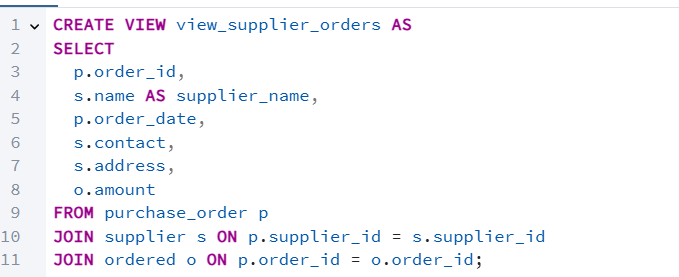

# שלב ג – אינטגרציה ומבטים

## שער

**שמות מגישים:** אביתר סאסי, ישראל שעשוע  
**המערכת:** מערכת ניהול עובדים  
**היחידה הנבחרת:** אגף משאבי אנוש

---

## תוכן עניינים

1. [מבוא](#מבוא)  
2. [תרשימי DSD ו-ERD](#תרשימי-dsd-ו-erd)  
3. [החלטות אינטגרציה](#החלטות-אינטגרציה)  
4. [פקודות שינוי טבלאות – Integrate.sql](#פקודות-שינוי-טבלאות--integratesql)  
5. [מבטים וניתוח נתונים – Views.sql](#מבטים-וניתוח-נתונים--viewssql)  
6. [גיבוי](#גיבוי)  
7. [סיכום](#סיכום)  

---

## מבוא

בשלב זה ביצענו אינטגרציה בין המערכת שלנו לבין מערכת נוספת שקיבלנו מזוג אחר. מטרת התהליך הייתה ליצור בסיס נתונים אחוד, תוך שמירה על שלמות הנתונים של שני הצדדים.

התהליך כלל:
- בניית DSD ו־ERD של המערכת שקיבלנו מהגיבוי.
- עיצוב ERD משולב.
- שינוי מבני של בסיס הנתונים באמצעות `ALTER TABLE`.
- טעינת נתונים תוך שמירה על עקביות.
- יצירת שני מבטים וכתיבת שאילתות משמעותיות לכל אחד.

---

## תרשימי DSD ו־ERD

### ERD של המערכת החדשה (שקיבלנו)

### DSD של המערכת החדשה (שקיבלנו)

### ERD משולב לאחר אינטגרציה

### DSD לאחר אינטגרציה

---

## החלטות אינטגרציה

- שמרנו על שמות הטבלאות והעמודות המקוריים כדי לא לפגוע בקוד קיים.
- מיזגנו בין ערכים זהים לפי מזהה `ID`, כאשר במקרי קונפליקט – הנתונים שלנו נשמרו.
- בטבלת `department` הוספנו עמודות `location` ו־`head_of_department`.
- לא יצרנו טבלאות חדשות – נעשה שימוש ב־`ALTER TABLE`.
- הנתונים הוזנו בעזרת `UPDATE` ו־`INSERT` עם התאמות כדי למנוע כפילויות ושגיאות מפתחות זרים.

---

## פקודות שינוי טבלאות – Integrate.sql

בשלב זה ביצענו שינויי סכימה משמעותיים לצורך התאמת בסיס הנתונים למבנה המשולב:

- **שינוי שם טבלה:** הטבלה `entitydepartment` שונתה ל־`department` כדי לאחד שמות בין המערכות.
- **שינוי שם עמודה:** העמודה `name` שונתה ל־`department_name` לטובת קריאות ברורה יותר.
- **הוספת עמודות:** הוספנו עמודה חדשה `head_of_department` שבאה מהמערכת של הזוג השני.
- **הגדרת מפתח ראשי:** וידאנו שהעמודה `department_id` מוגדרת כמפתח ראשי.

בנוסף, נוצרו מספר טבלאות חדשות שנלקחו מהמערכת השנייה:
- טבלת ספקים (`supplier`)
- פרטי מוצרים (`item`)
- קבלות ותשלומים (`receipt`)
- הזמנות רכש (`purchase_order`, `ordered`)
- ניהול מלאי (`stored_in`)
- הקשר בין ספק לפריט (`supplied_by`)

טבלאות אלו מבוססות על ERD חדש שהתקבל מהזוג השני, והשתלבו במערכת שלנו כחלק מהרחבת תשתית הרכש והספקים.

---

## מבטים וניתוח נתונים – `Views.sql`

### View 1 – ניתוח נוכחות עובדים באגף משאבי אנוש

#### תיאור המבט:

המבט `view_attendance_summary` מאגד מידע על נוכחות יומית של עובדים, כולל שם העובד, שם המחלקה, תאריך, וזמני כניסה ויציאה.  
באמצעות מבט זה ניתן לבצע ניתוחים כמו זיהוי עובדים שעובדים שעות חריגות, חישובי שעות חודשיות, או בדיקות איחורים.

#### SELECT * (10 רשומות ראשונות):

---

#### שאילתה 1 – עובדים שעבדו יותר מ־8 שעות ביום

**מטרה:**  
לאתר עובדים שהיו להם ימי עבודה חריגים באורכם.

**למה זה חשוב?**  
במערכת ניהול עובדים, אנחנו רוצים לדעת מי העובדים שנשארים הרבה מעבר לשעות העבודה. זה יכול להעיד על עומס יתר, חוסר איזון, או דווקא עובדים מצטיינים שמוכנים להשקיע יותר. תובנה כזו חשובה גם להחלטות שכר או חלוקת עומסים.

---

### View 2 – ריכוז נתוני רכש לפי ספק

#### תיאור המבט:

המבט `view_supplier_orders` מאחד מידע על כל הזמנת רכש: מזהה ההזמנה, שם הספק, תאריך ההזמנה, פרטי יצירת קשר, כתובת וסכום ההזמנה.  
המבט מאפשר להפיק ניתוחים כספיים ומנהליים, כמו כמות ההזמנות לכל ספק, סכומים חריגים, זיהוי ספקים מרכזיים, וניטור פעילות מסחרית מול גורמי חוץ.

#### CREATE VIEW:

---

### View 2 – ריכוז נתוני רכש לפי ספק

#### תיאור המבט:

המבט `view_supplier_orders` מאחד את פרטי ההזמנות מכל הספקים – כולל שם הספק, כמות, סכום, תאריך, ואמצעי יצירת קשר. הוא מאפשר לזהות ספקים מרכזיים, להבין עלויות ולבצע ניתוחים כלכליים.

#### SELECT * (10 רשומות ראשונות):

---

#### שאילתה 1 – ספקים עם הזמנות מעל ממוצע 2024

**מטרה:**  
למצוא את הספקים שקיבלו הזמנות שהיו משמעותית גבוהות מהממוצע באותה שנה.

**סיפור רקע:**  
בארגונים, כדאי לדעת אילו ספקים "יקרים" יותר או מרכזיים יותר בפעילות. אם ספק קיבל הרבה הזמנות גדולות ב־2024 – אולי כדאי לבדוק האם המחירים שלו משתלמים, או אולי דווקא לחזק איתו את שיתוף הפעולה. השאילתה הזאת מייצרת רשימה של ספקים שחרגו מהממוצע השנתי.

---

#### שאילתה 2 – סיכום הזמנות לפי ספק

**מטרה:**  
להציג לכל ספק את סך ההזמנות שבוצעו מולו – כמה הזמנות, סכום כולל, ממוצע להזמנה.

**למה זה חשוב?**  
זהו דו"ח קלאסי למחלקת רכש. אפשר בקלות לזהות מי הספקים המרכזיים לפי סכומים, לזהות ספקים שלא מבצעים כמעט עסקאות, ולקבל תובנות לגבי ניהול התקציב. זה עוזר בתכנון שנתי ובמשא ומתן עם הספקים.

---

## גיבוי

בוצע גיבוי מלא של בסיס הנתונים לאחר האינטגרציה ונשמר בשם `backup3`.

---

## סיכום

בשלב זה למדנו לבצע אינטגרציה מלאה בין שני בסיסי נתונים תוך שמירה על עקביות, התאמה לסכמות קיימות, וניצול כלים כמו Views ו־SQL מתקדמות לניתוח נתונים.  
הפקנו דו"חות משמעותיים המספקים תובנות עסקיות וניהוליות, בין אם על התנהגות עובדים ובין אם על ספקים והוצאות.  
התוצאה היא מערכת עשירה בנתונים, עם מבט הוליסטי על תפקוד הארגון משני צדדיו.

