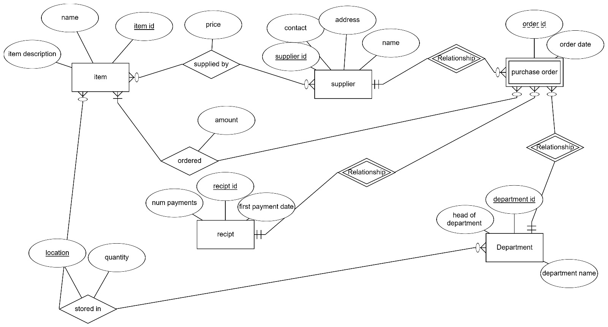
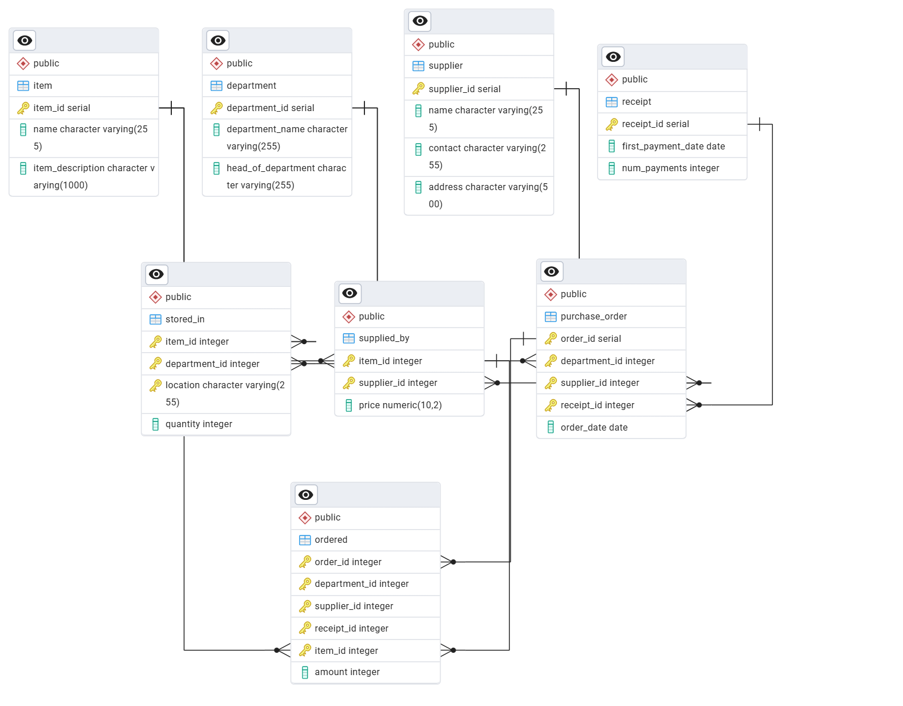
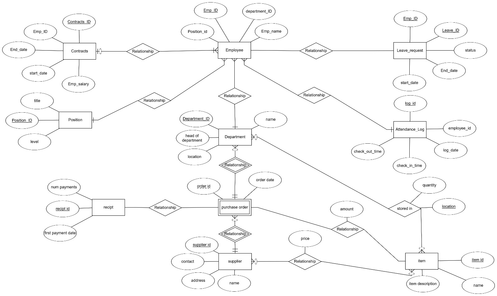
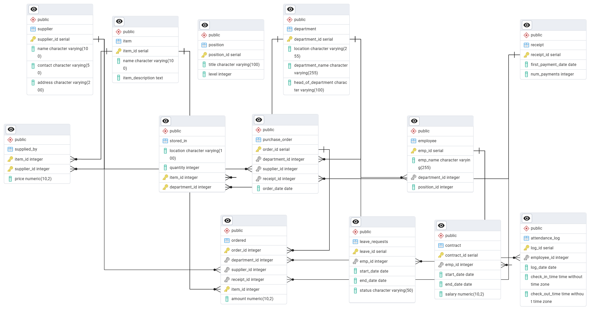
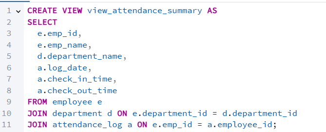
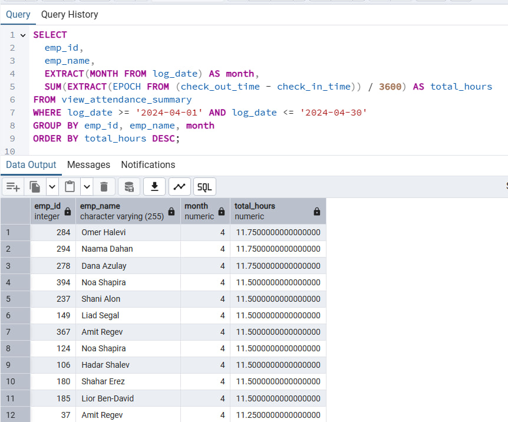
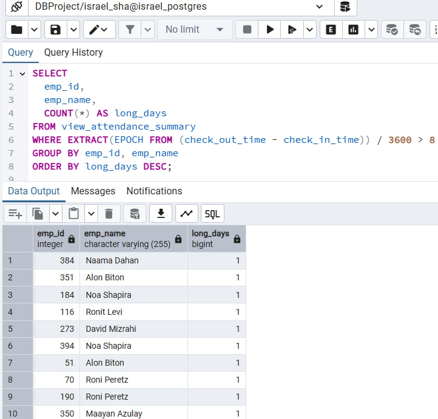
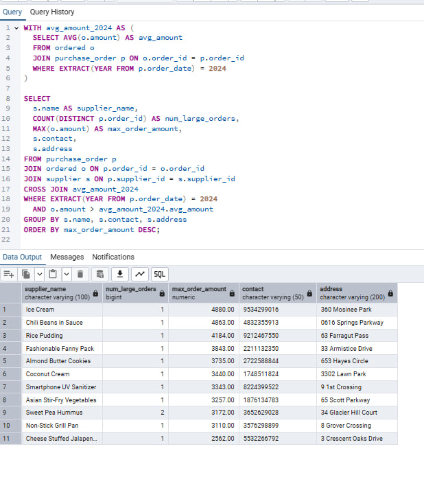
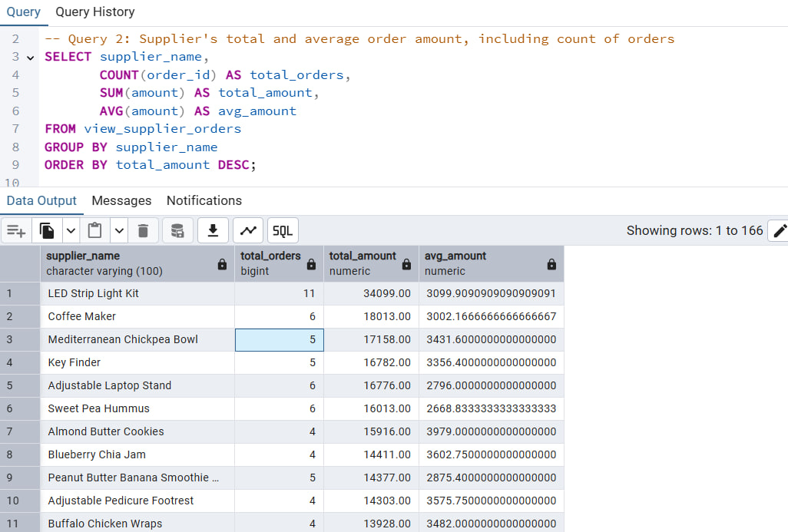

# שלב ג – אינטגרציה ומבטים

## שער

**שמות מגישים:** אביתר סאסי, ישראל שעשוע  
**המערכת:** מערכת ניהול עובדים  
**היחידה הנבחרת:** אגף משאבי אנוש

---

## תוכן עניינים

1. [מבוא](#מבוא)  
2. [תרשימי DSD ו-ERD](#תרשימי-dsd-ו-erd)  
3. [החלטות אינטגרציה](#החלטות-אינטגרציה)  
4. [פקודות שינוי טבלאות – Integrate.sql](#פקודות-שינוי-טבלאות--integratesql)  
5. [מבטים וניתוח נתונים – Views.sql](#מבטים-וניתוח-נתונים--viewssql)  
6. [גיבוי](#גיבוי)  
7. [סיכום](#סיכום)  

---

## מבוא

בשלב זה ביצענו אינטגרציה בין המערכת שלנו לבין מערכת נוספת שקיבלנו מזוג אחר. מטרת התהליך הייתה ליצור בסיס נתונים אחוד, תוך שמירה על שלמות הנתונים של שני הצדדים.

התהליך כלל:
- בניית DSD ו־ERD של המערכת שקיבלנו מהגיבוי.
- עיצוב ERD משולב.
- שינוי מבני של בסיס הנתונים באמצעות `ALTER TABLE`.
- טעינת נתונים תוך שמירה על עקביות.
- יצירת שני מבטים וכתיבת שאילתות משמעותיות לכל אחד.

---

## תרשימי DSD ו־ERD

### ERD של המערכת החדשה (שקיבלנו)

### DSD של המערכת החדשה (שקיבלנו)

### ERD משולב לאחר אינטגרציה

### DSD לאחר אינטגרציה

---

## החלטות אינטגרציה

- שמרנו על שמות הטבלאות והעמודות המקוריים כדי לא לפגוע בקוד קיים.
- מיזגנו בין ערכים זהים לפי מזהה `ID`, כאשר במקרי קונפליקט – הנתונים שלנו נשמרו.
- בטבלת `department` הוספנו עמודות `location` ו־`head_of_department`.
- לא יצרנו טבלאות חדשות – נעשה שימוש ב־`ALTER TABLE`.
- הנתונים הוזנו בעזרת `UPDATE` ו־`INSERT` עם התאמות כדי למנוע כפילויות ושגיאות מפתחות זרים.

---

## פקודות שינוי טבלאות – Integrate.sql

בשלב זה ביצענו שינויי סכימה משמעותיים לצורך התאמת בסיס הנתונים למבנה המשולב:

- **שינוי שם טבלה:** הטבלה `entitydepartment` שונתה ל־`department` כדי לאחד שמות בין המערכות.
- **שינוי שם עמודה:** העמודה `name` שונתה ל־`department_name` לטובת קריאות ברורה יותר.
- **הוספת עמודות:** הוספנו עמודה חדשה `head_of_department` שבאה מהמערכת של הזוג השני.
- **הגדרת מפתח ראשי:** וידאנו שהעמודה `department_id` מוגדרת כמפתח ראשי.

בנוסף, נוצרו מספר טבלאות חדשות שנלקחו מהמערכת השנייה:
- טבלת ספקים (`supplier`)
- פרטי מוצרים (`item`)
- קבלות ותשלומים (`receipt`)
- הזמנות רכש (`purchase_order`, `ordered`)
- ניהול מלאי (`stored_in`)
- הקשר בין ספק לפריט (`supplied_by`)

טבלאות אלו מבוססות על ERD חדש שהתקבל מהזוג השני, והשתלבו במערכת שלנו כחלק מהרחבת תשתית הרכש והספקים.

---

## מבטים וניתוח נתונים – `Views.sql`

### View 1 – ניתוח נוכחות עובדים באגף משאבי אנוש

#### תיאור המבט:

המבט `view_attendance_summary` מאגד מידע על נוכחות יומית של עובדים, כולל שם העובד, שם המחלקה, תאריך, וזמני כניסה ויציאה.  
באמצעות מבט זה ניתן לבצע ניתוחים כמו זיהוי עובדים שעובדים שעות חריגות, חישובי שעות חודשיות, או בדיקות איחורים תכופים.

#### SELECT * (10 רשומות ראשונות):

---

#### שאילתה 1 – עובדים שעבדו יותר מ־8 שעות ביום

**מטרה:**  
לזהות עובדים שביצעו משמרות ארוכות במיוחד.

**למה זה חשוב?**  
שעות עבודה חריגות עשויות להעיד על עומס יתר, עובדים מחויבים במיוחד, או חוסר איזון בתכנון כוח האדם. בעזרת השאילתה הזו ניתן לאתר תבניות של שחיקה או השקעה יוצאת דופן.

---

#### שאילתה 2 – סיכום שעות חודשי לעובדים באפריל 2024

**מטרה:**  
לחשב כמה שעות צבר כל עובד במהלך חודש מסוים (במקרה זה: אפריל 2024).

**סיפור רקע:**  
בסוף כל חודש נדרש דו"ח נוכחות לצורכי שכר, פריון עבודה ומעקב אחרי חריגות. שאילתה זו מספקת את סך השעות החודשי לכל עובד, נתון חיוני להנהלה ולמנהלי מחלקות.

---

### View 2 – ריכוז נתוני רכש לפי ספק

#### תיאור המבט:

המבט `view_supplier_orders` מאחד מידע על הזמנות רכש מכל הספקים – כולל מזהה ההזמנה, שם הספק, תאריך, סכום, ופרטי יצירת קשר.  
הוא מאפשר לבצע מעקב אחר ספקים מרכזיים, לזהות ספקים חריגים בפעילותם, ולהפיק דו"חות רכש לצורכי תכנון תקציבי, בקרה והמשכיות עסקית.

#### SELECT * (10 רשומות ראשונות):

---

#### שאילתה 1 – ספקים עם הזמנות מעל ממוצע שנת 2024

**מטרה:**  
לאתר ספקים שביצעו עסקאות גבוהות מהממוצע הכללי בשנה הנוכחית.

**סיפור רקע:**  
ארגונים מעוניינים לזהות מי הספקים הבולטים מבחינת היקף עסקאות. ספק עם הזמנות שמעל הממוצע יכול להעיד על תלות יתר או דווקא על שותפות אסטרטגית. נתון זה עוזר גם בהחלטות מיקוח וחידוש חוזים.

---

#### שאילתה 2 – סיכום הזמנות לפי ספק

**מטרה:**  
לסכם לכל ספק את מספר ההזמנות, הסכום הכולל והממוצע להזמנה.

**למה זה חשוב?**  
דו"ח זה נותן מבט כולל על ההיקף העסקי של כל ספק מול הארגון. הוא מאפשר להבין מי הם הספקים הפעילים ביותר, כמה כסף הושקע בכל אחד, ולבצע ניתוחים תקציביים ארוכי טווח.

---

## גיבוי

בוצע גיבוי מלא של בסיס הנתונים לאחר ביצוע האינטגרציה והוספת המבטים.  
הגיבוי נשמר בשם `backup3.backup` בפורמט Custom.

---

## סיכום

בשלב זה למדנו לבצע אינטגרציה מלאה בין שני בסיסי נתונים תוך שמירה על עקביות, התאמה לסכמות קיימות, וניצול כלים כמו Views ו־SQL מתקדמות לניתוח נתונים.  
הפקנו דו"חות משמעותיים המספקים תובנות עסקיות וניהוליות, בין אם על התנהגות עובדים ובין אם על ספקים והוצאות.  
התוצאה היא מערכת עשירה בנתונים, עם מבט הוליסטי על תפקוד הארגון משני צדדיו.

