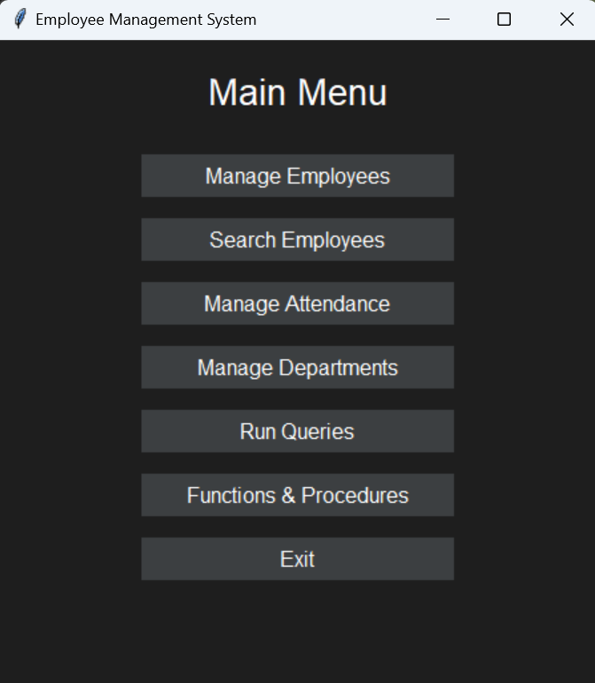
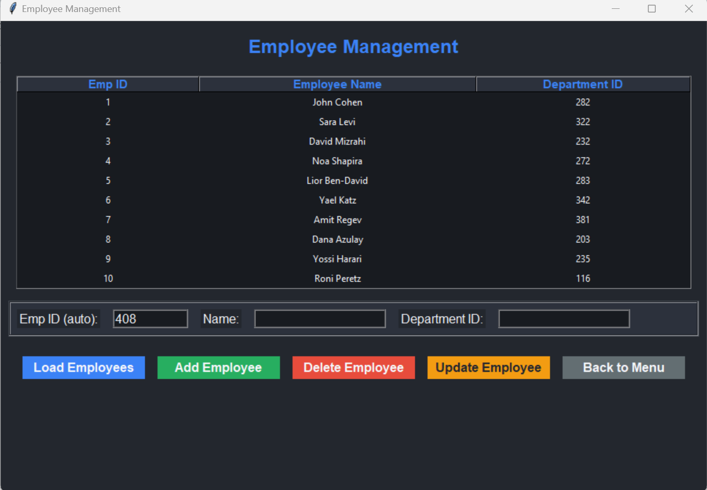
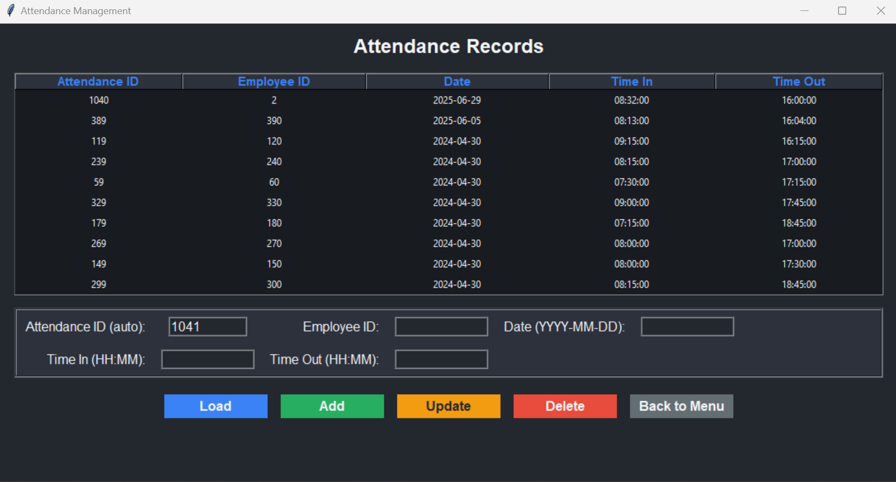
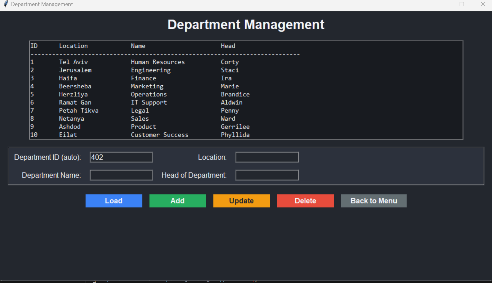
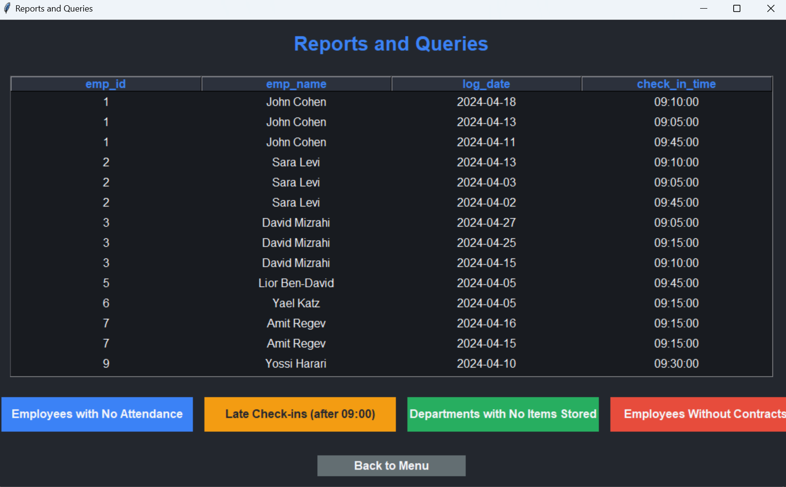
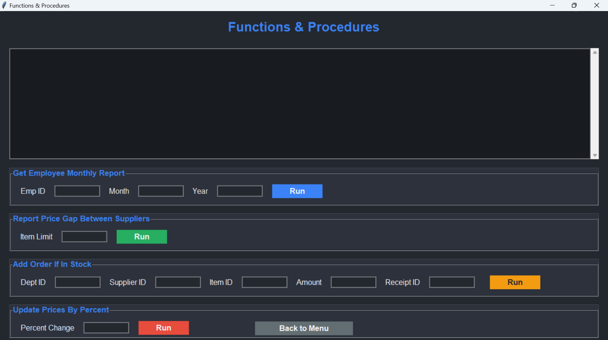
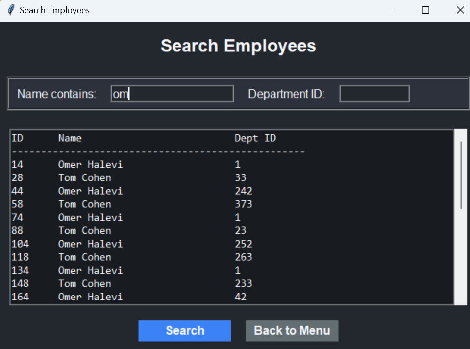

# שלב ה – ממשק גרפי ואינטגרציה עם בסיס הנתונים

## שער

**שמות מגישים:** אביתר סאסי, ישראל שעשוע  
**שם המערכת:** מערכת ניהול עובדים  
**יחידה נבחרת:** אגף משאבי אנוש

---

## תוכן עניינים

1. [מבוא](#מבוא)  
2. [הוראות הפעלה](#הוראות-הפעלה)  
3. [כלים וטכנולוגיות](#כלים-וטכנולוגיות)  
4. [מבנה המערכת](#מבנה-המערכת)  
5. [מסכים ואפשרויות](#מסכים-ואפשרויות)  
6. [עיצוב ותצוגה גרפית](#עיצוב-ותצוגה-גרפית)  
7. [שימוש בפונקציות ופרוצדורות](#שימוש-בפונקציות-ופרוצדורות)  
8. [סיכום](#סיכום)  
9. [קבצים ותיקיות להגשה](#קבצים-ותיקיות-להגשה)

---

## מבוא

בשלב זה פותחה מערכת ממשק גרפי מלאה לעבודה מול בסיס הנתונים, תוך שימוש ב־Python וספריית `tkinter`, עם עיצוב Dark Mode מודרני.  
הממשק מאפשר שליטה מלאה בנתונים ללא צורך בכתיבת SQL על ידי המשתמש.

---

## הוראות הפעלה

1. ודא כי PostgreSQL רץ וה־database בשם `DBProject` קיים.
2. ודא שהטבלאות, הפונקציות והפרוצדורות קיימות במסד.
3. התקן את החבילות הדרושות:
   ```bash
   pip install psycopg2
   ```
4. ודא שקובץ `db_config.py` כולל את פרטי ההתחברות הנכונים:
   ```python
   DB_CONFIG = {
       'dbname': 'DBProject',
       'user': '...',
       'password': '*****',
       'host': 'localhost',
       'port': '5432'
   }
   ```
5. הפעל את המערכת:
   ```bash
   python main.py
   ```

---

## כלים וטכנולוגיות

- **Python 3.11**
- **Tkinter** – לבניית הממשק הגרפי
- **PostgreSQL** – בסיס הנתונים הרלציוני
- **psycopg2** – חיבור בין Python ל-PostgreSQL
- ארכיטקטורה מודולרית – מסך אחד לכל טבלה/פעולה

---

## מבנה המערכת

| קובץ | תיאור |
|------|--------|
| `main.py` | מסך כניסה ראשי לכל שאר המסכים |
| `employee_screen.py` | ניהול טבלת עובדים (CRUD) |
| `attendance_screen.py` | רישום ועדכון נוכחות |
| `department_screen.py` | ניהול טבלת מחלקות |
| `query_screen.py` | הרצת שאילתות ניתוחיות |
| `plsql_screen.py` | הרצת פונקציות ופרוצדורות |
| `search_screen.py` | חיפוש עובדים |
| `db_config.py` | פרטי התחברות למסד הנתונים |

---

## מסכים ואפשרויות

### 🏠 מסך ראשי (`main.py`)

המסך הראשי שממנו ניתן לגשת לכל שאר המסכים:
- ניהול עובדים
- רישום נוכחות
- ניהול מחלקות
- הפעלת שאילתות
- הפעלת פונקציות ופרוצדורות
- חיפוש עובדים

**צילום מסך:**  


---

### 🧑‍💼 מסך ניהול עובדים (`employee_screen.py`)

- הוספת עובד חדש
- עדכון פרטי עובד (שם ומחלקה)
- מחיקת עובד לפי מזהה
- הצגת רשימת עובדים בטבלה

**צילום מסך:**  


---

### 🕒 מסך רישום נוכחות (`attendance_screen.py`)

- הזנת כניסה ויציאה לעובדים
- בדיקת תקינות נתונים (טיימסטמפ, ID קיים)
- הצגת רשימת נוכחות קיימת

**צילום מסך:**  


---

### 🏢 מסך ניהול מחלקות (`department_screen.py`)

- הוספת מחלקה חדשה
- עדכון פרטי מחלקה
- מחיקה והצגה מלאה של טבלת מחלקות

**צילום מסך:**  


---

### 📊 מסך שאילתות ניתוחיות (`query_screen.py`)

- עובדים ללא נוכחות
- כניסות מאוחרות (אחרי 09:00)
- מחלקות שאין בהן פריטים
- עובדים ללא חוזים

**צילום מסך:**  


---

### ⚙️ מסך פרוצדורות ו־PL/pgSQL (`plsql_screen.py`)

- `add_order_if_in_stock` – מוסיף הזמנה רק אם יש מספיק מלאי
- `update_prices_by_percent` – מעדכן אחוזית את המחירים
- שתי פונקציות מתקדמות להצגת מידע על עובדים ומחלקות

**צילום מסך:**  


---

### 🔎 מסך חיפוש עובדים (`search_screen.py`)

- חיפוש לפי מזהה, שם, או טקסט כללי
- תוצאה מיידית בתצוגה מסודרת

**צילום מסך:**  


---

## עיצוב ותצוגה גרפית

- עיצוב **Dark Mode** מלא
- כפתורים בצבע אחיד, קריאים ונוחים למשתמש
- תצוגת טבלאות בגופן אחיד (monospace)
- חלוקה ללייבלים ואזורים לכל פעולה
- מסכים רספונסיביים יחסית לגודל חלון

---

## שימוש בפונקציות ופרוצדורות

### ✅ פרוצדורות:
- `add_order_if_in_stock(p_department_id, p_supplier_id, p_item_id, p_amount, p_receipt_id)`
- `update_prices_by_percent(p_percent)`

### ✅ פונקציות:
- `get_employee_contract_count(emp_id)`
- `get_items_in_department(dept_id)`

ניתנות להפעלה ממסך `plsql_screen.py` – עם שדות קלט לכל פרמטר נדרש.

---

## סיכום

שלב זה כלל את בניית ממשק גרפי אינטראקטיבי מלא מעל בסיס הנתונים שלנו, עם שימוש בלוגיקה עסקית, עיצוב מודרני, וחוויית משתמש פשוטה.  
המערכת כוללת את כל הדרישות: CRUD על 3 טבלאות, הפעלת שאילתות, חיפוש, והרצת פונקציות/פרוצדורות.

---

## קבצים ותיקיות להגשה

- תיקיית `שלב ה/` – כוללת את כל קבצי הממשק
- קובץ `main.py` – נקודת ההפעלה הראשית
- קובץ `db_config.py` – פרטי התחברות
- תיקיית `screenshots/` – תמונות מסך לכל מסך
- קובץ `README_stage_E.md` (זה הקובץ)

